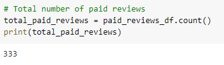
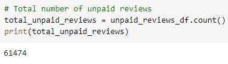
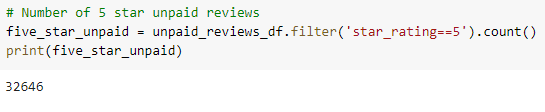
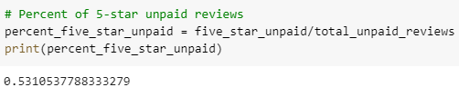

# Amazon_Vine_Analysis

## Overview
The purpose of this analysis is to determine if there is any bias toward favorable reviews on from Vine members (paid reviewers) in the SPORTS dataset. This analysis is for SellBy stakeholders. The data was set from amazon reviews regarding sports and it was used Pyspark to perform the ETL process by extracting the data, transforming the data and connecting to the database that was generated through the AWS webserver. The main goal is to try and determine if there is favorable review bias from the Vine members of our data set.

## Results 

### How many Vine reviews and non-Vine reviews were there?

Total number of Vine Reviews:

Total number of Non-Vine Reviews:

### How many Vine reviews were 5 stars? How many non-Vine reviews were 5 stars?

Total number of Vine 5 Star Reviews:

Total number of Non-Vine 5 Star Reviews:

### What percentage of Vine reviews were 5 stars? What percentage of non-Vine reviews were 5 stars?

Percentage of Vine 5 Star Reviews:

Total number of Non-Vine 5 Star Reviews:

## Summary:
There does not appear to be a bias for the Vine program as evidenced by the 5-star percentage between paid (42%) and unpaid (53%), with percentage very similar. In addition, the total count of reviews is 61,948. Of these reviews, 99.5% of them are from non-Vine reviewers. This ovewhelming majority of non-paid reviewers removes any hint of bias towards the overall assessment.
In conclusion, the analysis the vine program does not show any bias.
